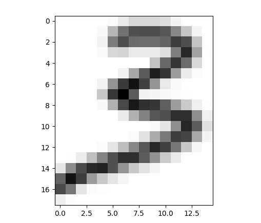
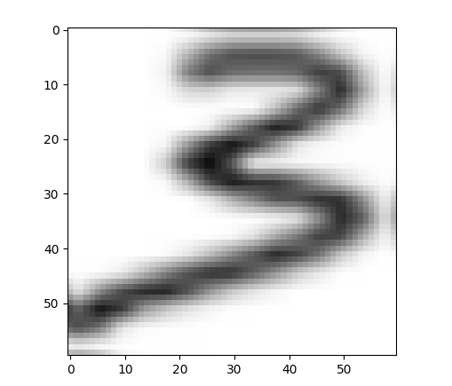
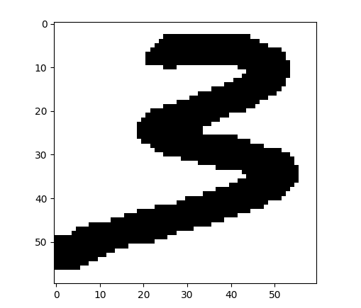
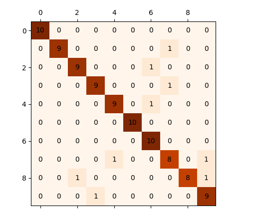
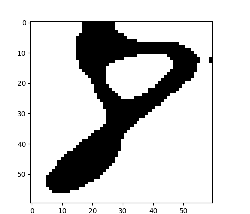

---
author:
- Joris Lasserre
title: Reconnaissance de chiffres manuscrits par plus proches voisins
---

# Introduction

## Présentation du projet

L'objectif de ce projet est de développer une application de
reconnaissance de chiffres manuscrits. Le principe est simple, fournir
un chiffre manuscrit au programme sans préciser son intitulé, et le
programme doit être capable de l'identifier. Pour cela, nous utiliserons
l'apprentissage supervisé. Selon la définition de la CNIL,
"l'apprentissage supervisé est un procédé d'apprentissage automatique
dans lequel l'algorithme s'entraîne à une tâche déterminée en utilisant
un jeu de données assorti de chaque annotation indiquant le résultat
attendu."

Nous nous appuierons plus particulièrement sur l'algorithme des k-plus
proches voisins (k-Nearest Neighbors ou k-NN) dans ce projet.
L'algorithme K-NN va permettre de trouver le résultat en analysant les
distances calculées entre nos nombres et en prenant comme réponse
l'intitulé le plus fréquent parmi les K voisins les plus proches.
Maintenant que nous avons vu l'objectif du projet, nous allons pouvoir
nous pencher en détail sur la base de données utilisée et les enjeux
scientifiques de celui-ci.

## Présentation de la base

La base de données utilisée est un extrait de 120 images, 10 de chaque
chiffre et caractère "plus" et "moins", issus de la base de données du
MNIST (Modified National Institute of Standards and Technology
database). J'ai décidé par gain de temps de ne pas traiter les signes
"plus" et "moins".

Ces images sont toutes "labélisées" par l'intitulé de leur chiffre, ce
qui nous permettra plus tard de comparer la prédiction de notre
programme avec les résultats attendus. Un point important à uniformiser
lors de la partie traitement d'image est le fait que les images n'aient
pas toutes la même taille, ce qui pourrait poser problème.

## Les enjeux scientifiques de la reconnaissance de caractères

À première vue, nous pourrions penser qu'une application qui reconnaît
des nombres manuscrits n'a d'utilité que celle de divertir un groupe
d'étudiants en informatique. Néanmoins, lorsqu'on y réfléchit un peu
plus, on y trouve de nombreuses utilités, comme le traitement de
documents (chèques, numérisation de dossiers), la reconstitution de
papyrus altérés par le temps, ou encore la détection des inscriptions
écrites sur les panneaux routiers utilisée par les voitures autonomes.

Nous pouvons même évoquer le fait que la reconnaissance de caractères
manuscrits permet d'alimenter d'autres IA ou algorithmes capables
d'imiter l'écriture manuscrite humaine à partir de seulement quelques
images, comme le réseau "GANwriting". À terme, l'objectif serait d'avoir
des modèles généraux capables de reconnaître la quasi-totalité des
langues, malgré le bruit, notamment celles avec des alphabets différents
ou des styles d'écriture particuliers et difficiles à lire, comme
l'écriture cursive russe.

Enfin, la reconnaissance de caractères manuscrits n'est qu'un premier
pas dans les sciences de la reconnaissance d'image. En effet, ces
techniques sont ou seront déjà utilisées dans divers domaines allant de
la médecine à l'automobile, en passant par l'archéologie.

# Proposition d'une solution

## Chaîne de traitement et d'analyse

La chaîne de traitement que j'ai mise en place comporte quatre parties.
Pour illustrer le processus, je vais modifier le chiffre ci-dessous dont
voici l'image originale :

{width="50%"}

Étant donné que les images n'ont pas toutes la même taille, la première
étape consiste à les redimensionner pour les uniformiser.

{width="50%"}

Ensuite pour pouvoir appliquer l'érosion, la dilatation et faciliter le
comptage des pixels il est nécessaire de binariser l'image. C'est à dire
convertir chaque pixel en noir ou en blanc. Une étape intermédiaire
consiste d'abord à convertir l'image en niveaux de gris.

{width="50%"}

Une fois cette étape terminée, nous appliquons une érosion pour éliminer
les zones de bruit et autres formes susceptibles d'altérer la
reconnaissance.

{width="50%"}

Enfin, nous procédons à une dilatation pour restaurer la qualité de
certains chiffres.

{width="50%"}

Dans ce cas particulier, l'image binarisée et l'image finale semblent
similaires. Cependant, sur l'ensemble des images, ces étapes permettent
de gagner en précision en éliminant certains bruits et en se concentrant
sur les traits caractéristiques du chiffre.

## Détail d'un algorithme d'extraction de caractéristiques

J'ai choisi d'utiliser comme algorithme d'extraction de caractéristiques
le "Zoning". Celui-ci consiste à découper l'image binarisée en blocs et
à calculer pour chaque bloc une caractéristique précise. Dans notre cas
cette caractéristiques est le nombre de pixel noir.

Dans la manière dont j'ai implémenté l'algorithme, je ne spécifie pas
directement le nombre de blocs souhaité pour la découpe de l'image. A la
place je prends le carré de N. Dans mon cas, comme N vaut 5, mes images
sont divisées en 25 blocs. L'algorithme retourne à la fin un vecteur de
N caractéristiques.

Exemple de vecteur de caractéristiques pour un chiffre 3 : \[0, 3, 58,
65, 21, 0, 6, 55, 62, 13, 0, 12, 69, 68, 34, 3, 33, 58, 63, 18, 69, 27,
1, 0, 0\].

# Analyse des résultats

Pour rappel, l'objectif de notre programme est de reconnaître des
chiffres manuscrits allant de 0 à 9. Pour évaluer les performances de
l'algorithme, nous avons effectué 100 tests avec les critères suivants :

-   99 images sont utilisées comme base d'apprentissage.

-   L'image restante sert de test, et son label n'est pas connu à
    l'avance.

-   Nous calculons la distance entre le vecteur représentant l'image de
    test et ceux des 99 autres images.

-   Les distances sont triées par ordre croissant.

-   Les K plus petites distances sont sélectionnées (Dans mon cas, k =
    3).

-   Le label le plus présent parmi les K voisins les plus proches est
    attribué à l'image de test.

-   Si la prédiction est correcte, nous incrémentons le nombre de bonnes
    réponses.

-   Le pourcentage de bonnes réponses est calculé à partir du nombre de
    prédictions correctes sur le nombre total de réponse puis multiplié
    par 100.

## Présentation d'une matrice de confusion

Avant de vous montrer le résultat final sous forme de matrice de
confusion, je vais vous en expliquer le fonctionnement.

Une matrice de confusion est un tableau 2D où les lignes représentent
les labels réels et les colonnes les labels prédits. Les valeurs sur la
diagonale indiquent les prédictions correctes, tandis que les valeurs
hors diagonale représentent les erreurs. Dans notre cas, le programme
sait reconnaître un nombre lorsque le chiffre dans la diagonale est
10/10.

{width="50%"}

Le résultat final que j'obtiens est cette matrice de confusion avec un
taux de reconnaissance de 91%. Les paramètres qui parviennent à avoir ce
taux de réussite sont :

-   nombre de plus k-proches voisins considérés : 3

-   Nombre de blocs : 25.

-   Taille de l'élément structurant pour l'érosion et la dilatation : 3.

-   Dimensions de redimensionnement : 60x60 pixels.

## Analyse des erreurs

Nous allons essayé de comprendre les cas où le programme n'a pas donné
la bonne réponse.

L'une des premières erreurs est la confusion \"naturelle\" entre le 7 et
le 1, en raison de leur ressemblance lorsqu'ils sont écrits à la main.

On remarque aussi, des erreurs pour le chiffre 8. Les traitements
appliqués aux images altèrent parfois la forme des 8, les rendant
similaires à d'autres chiffres, comme le 9.

{width="50%"}

Je pense que ces \"malformations\" sont le cas le plus courant de mes
erreurs, elles modifient certains autres chiffres déjà mal écrit ce qui
entraîne une mauvaise estimation. Néanmoins certaines erreurs restent
mystérieuses et nécessisteraient d'approfondir plus les recherches comme
pourquoi un 4 a été estimé un 6.

# Conclusion

En conclusion, nous avons développé un programme de reconnaissance de
chiffres manuscrits avec un taux de réussite de 91%. Ce résultat peut
être amélioré en augmentant le nombre de données d'entraînement, en
incluant davantage de cas pouvant porter à confusion. Il serait
également possible d'affiner les étapes de dilatation et d'érosion pour
éliminer le bruit tout en conservant les formes des chiffres.
